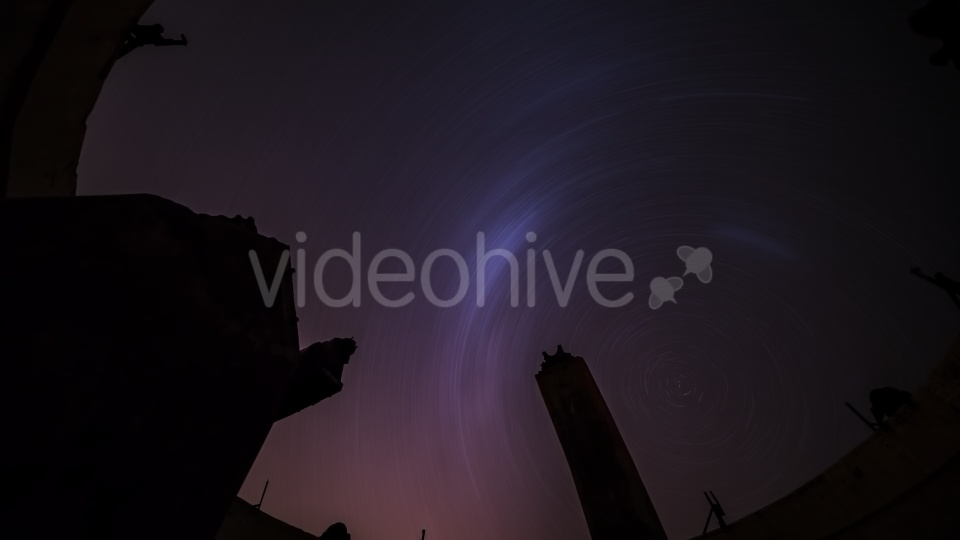
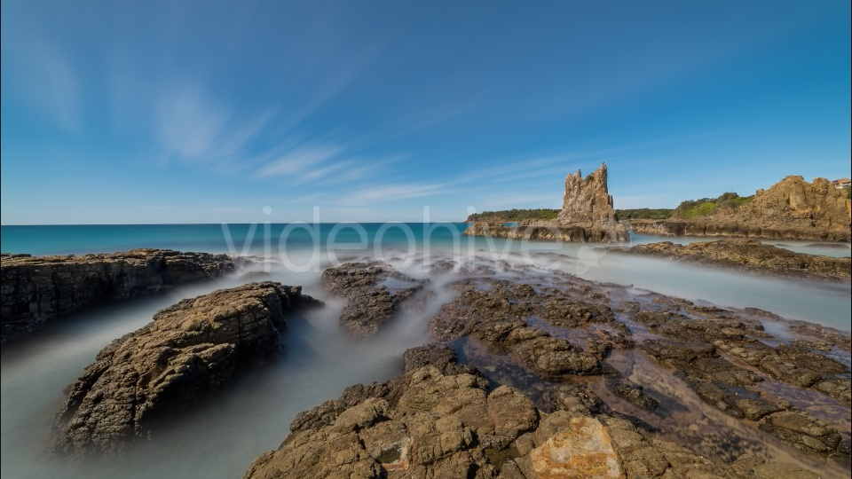
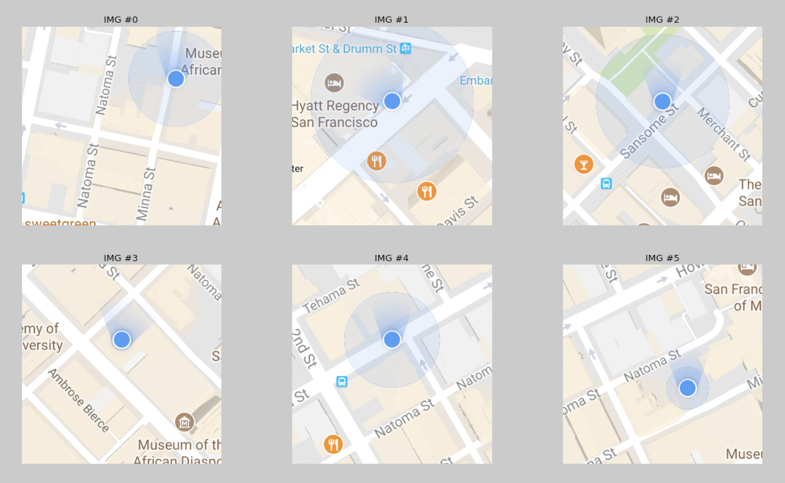
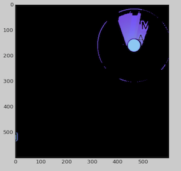
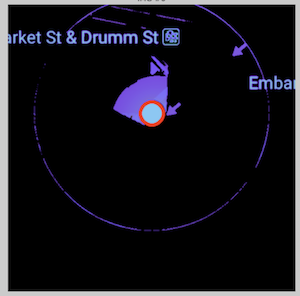
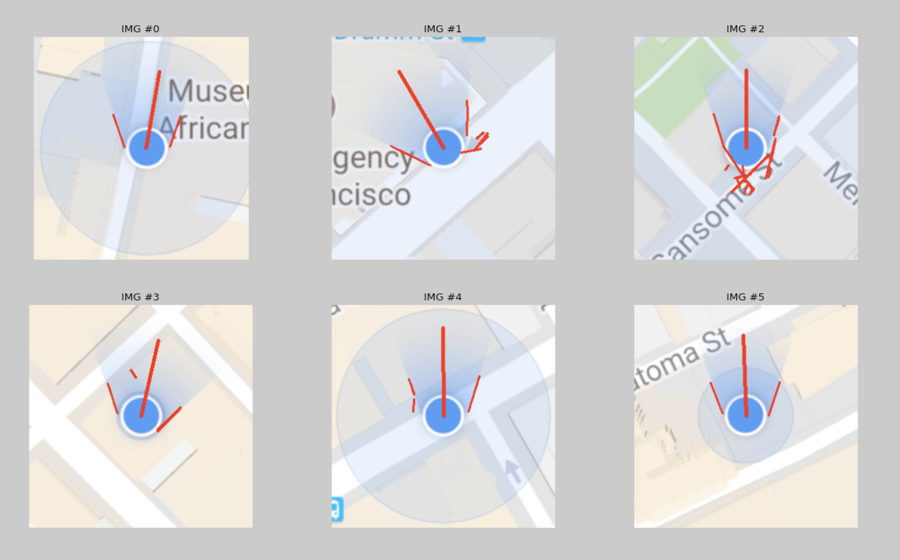

# **Fun Projects on Computer Vison** 

## Project I: Long Exposure Effect

One of my favorite photography techniques is long exposure, the process of creating a photo that shows the effect of passing time, something that traditional photography does not capture. This is an experiment on converting a video file into a jpg file with long time exposure effect, with OpenCV and Python.

The first example showing here is starry night with earth rotation tracked by the milky way. The source video file can be found at [videohive.net][https://videohive.net/item/milky-way-from-ruined-observatory/12467677]
The output is shown below


The second example is showing the silky smooth sea waves. The source video is downloaded at [videohive.net][https://videohive.net/item/waves-breaking-at-cathedral-rocks/19079293]. And the output is shown below


---

## Project II: Circle and Line Detection

This is part of side project to automate the data collection process. The idea is to detect the compass heading based on the Maps screenshots only. 

The original screenshot is shown below:



There are a few challenges here:

- The blue dot, which represent current location, is not always located at the center of the image. So pre-defining a ROI will not work
- There are multiple circles with similar diameter in the screenshot, which makes filtering algorithm impossible by using certain diameter

The final algorithm is designed as below:

- Notice that the location dot and heading fan shape are in color blue. Lower and upper thresholds for filtering out blue color in HSV color space are defined as

```python
   # define threshold for blue region in HSV space
    lower_blue = np.array([40,30,150])
    upper_blue = np.array([180,220,255])
```
This works great, as the image shown below.



- Then only H channel was extracted for further detection. After converting H channel to grayscale, a magnitude of gradient filter was applied. This essentially acts as a customized edge detector instead of calling Canny algorithm
```python
    gray_binary = mag_thresh(gray, sobel_kernel=3, thresh=(1, 80))
```
- After the edge is extracted, the standard HoughCircle() in OpenCV was called with following parameters
```python
    circles = cv2.HoughCircles(gray_binary*255,cv2.HOUGH_GRADIENT,1,20,
                            param1=50,param2=30,minRadius=20,maxRadius=45)
```
- To further filter out other circles with the same size, a circle mask was first used, and the standard deviation of all pixels within the circle is used to determine if the circle is painted with pure color, or it has landmark signs. The latter will result a higher standard deviation number than the former. In this way, the location dot is properly detected, as shown below for the second screenshot.



- Once the center of the circle is identified, the image was further cropped to center the detected circle.

- To detect heading, which is shown as a fan shape with two sides tangiential to the detected circle, a coordination transform from cartersian to polar was applied so the fan shape will be transformed into a plateau area. A subroutine find_histogram_plateau() was used to find the start and end point of the median level from half height to full height of the plateau area. This essentially anchors the start angle and end angle for the fan shape in cartersian coordinates. Simply averaging starting and ending angles will give us the center direction of the fan shape, which is actually heading angle, as shown below.



-  Next step is try to detect closest streets so that the physical device heading can be obtained, by assuming our dedicated tester always takes snapshot when the device is aligned with major street. The other assumption here is the location from GPS is not too noisy so the detected circle center should be at the edge of the major street.
-  For this purpose, the cropped image was first converted from RGB color-space to HLS color-space, and only L channel was used and addtional filters were applied:
```python
l_channel = binary_it(cv2.GaussianBlur(hls_img[:,:,1],(3,3),5), [240, 255])
```
- The binari-ed L channel was grouped by island with a threshold of 1000 pixels so short segments which are normally noise will be filtered out except major roads.
- Finally a subroutine find_primary_road() was used to find the longest lines from the image and the road direction can be calculated.

